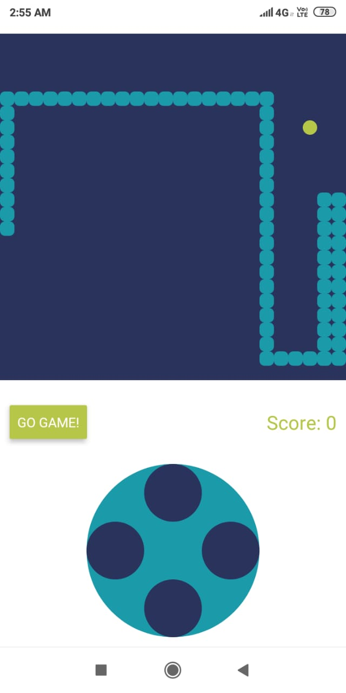

# Snek

> Classic snake game built in react native

To run locally:
- Setup react native development environment
- in the root folder, do npm install and then start metro server and install the app on emulator
- the gameplay is pretty basic

Uses:
- <a href='https://www.npmjs.com/package/react-native-game-engine' target='_blank'>react-native-game-engine</a>

 

Preview:

